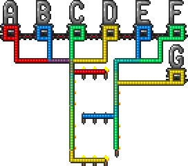

# Algebra on ``\mathbb{Z}_2``

Algebra on ``\mathbb{Z}_2`` is a useful tool for modelling and solving problems in Terraria logical wiring. [Z2Algebra.jl](https://github.com/putianyi889/Z2Algebra.jl) provides the functionality we need.

```julia
julia> using Pkg; Pkg.add(url="https://github.com/putianyi889/Z2Algebra.jl")

julia> using Z2Algebra
```
```@setup hash941
using Z2Algebra
```

## Introduction to ``\mathbb{Z}_2``
Basically, ``\mathbb{Z}_2`` is a set with two elements: 0 and 1, which can be viewed as even and odd numbers. The addition and multiplication operations on ``\mathbb{Z}_2`` follow those of the even and the odd numbers, that is,
```@repl hash941
Z2Number(0)+Z2Number(0), Z2Number(1)+Z2Number(1)
Z2Number(0)+Z2Number(1), Z2Number(1)+Z2Number(0)
Z2Number(0)*Z2Number(0), Z2Number(0)*Z2Number(1), Z2Number(1)*Z2Number(0)
Z2Number(1)*Z2Number(1)
```

``\mathbb{Z}_2`` is related to Terraria logical wiring. Let ``0``-``1`` represent the `false`-`true` states of a wire/lamp. 
- Suppose that multiple wires connect to the same lamp/torch, then the state of the lamp is the sum of the wire states in the ``\mathbb{Z}_2`` sense. 
- Suppose that an AND gate has multiple lamps, then the state of the AND gate is the product of the lamp states in the ``\mathbb{Z}_2`` sense.

## Vectors and Matrices
A ``\mathbb{Z}_2`` vector is a sequence of ``\mathbb{Z}_2`` numbers. It can represent
- The lamp states on a gate,
- The states of a series of wires,
- The segment states of a segment display.

A ``\mathbb{Z}_2`` matrix is a 2-dimensional array of ``\mathbb{Z}_2`` numbers. It can represent the connection between ``\mathbb{Z}_2`` vectors.

### Guide: a segment display
Consider the 7-segment display



Denote the 7 wires by ``A,B,C,D,E,F,G`` as shown in the image. Let the two vertical segments on the left be ``a,b``, three in the middle be ``c,d,e``, and the two on the right be ``f,g``, all from top to bottom. The 7-segment display can then be represented by the following matrix

```math
\mathbf{M} = \left(
\begin{array}{c|ccccccc}
  & A & B & C & D & E & F & G \\\hline
a & 0 & 1 & 1 & 1 & 0 & 0 & 0 \\
b & 0 & 0 & 1 & 1 & 0 & 0 & 0 \\
c & 1 & 0 & 0 & 0 & 0 & 0 & 0 \\
d & 0 & 0 & 0 & 0 & 1 & 0 & 0 \\
e & 0 & 0 & 0 & 1 & 0 & 0 & 0 \\
f & 0 & 0 & 0 & 0 & 1 & 1 & 1 \\
g & 0 & 0 & 0 & 0 & 0 & 1 & 0 \\
\end{array}
\right)
```

With `Z2Algebra.jl`, this matrix can be created via
```@repl hash941
M = Z2Matrix([
    0 1 1 1 0 0 0;
    0 0 1 1 0 0 0;
    1 0 0 0 0 0 0;
    0 0 0 0 1 0 0;
    0 0 0 1 0 0 0;
    0 0 0 0 1 1 1;
    0 0 0 0 0 1 0;
])
```

The wire states can be represented by a ``\mathbb{Z}_2`` vector of length 7, for example,
```math
\mathbf{x} = 
\left(
\begin{array}{c|c}
A&1\\
B&0\\
C&1\\
D&1\\
E&1\\
F&1\\
G&0
\end{array}
\right)
```
```@repl hash941
x = Z2ColVector([1, 0, 1, 1, 1, 1, 0])
```

Then, the segment states denoted by vector ``\mathbf{y}`` can be calculated by
```@repl hash941
y = M * x
```
```math
\mathbf{y} = \mathbf{M}\mathbf{x} =
\left(
\begin{array}{c|c}
a&1\\
b&0\\
c&1\\
d&1\\
e&1\\
f&0\\
g&0
\end{array}
\right)
```

!!! note "Nontrivial initial state"
    If the initial segment states are ``\mathbf{y}_0\ne \mathbf{0}``, then ``\mathbf{y}=\mathbf{M}\mathbf{x}+\mathbf{y}_0``.

Conversely, providing the segment states ``\mathbf{y}``, we can obtain the wire states ``\mathbf{x}`` through
```@repl hash941
x = M \ y
```
